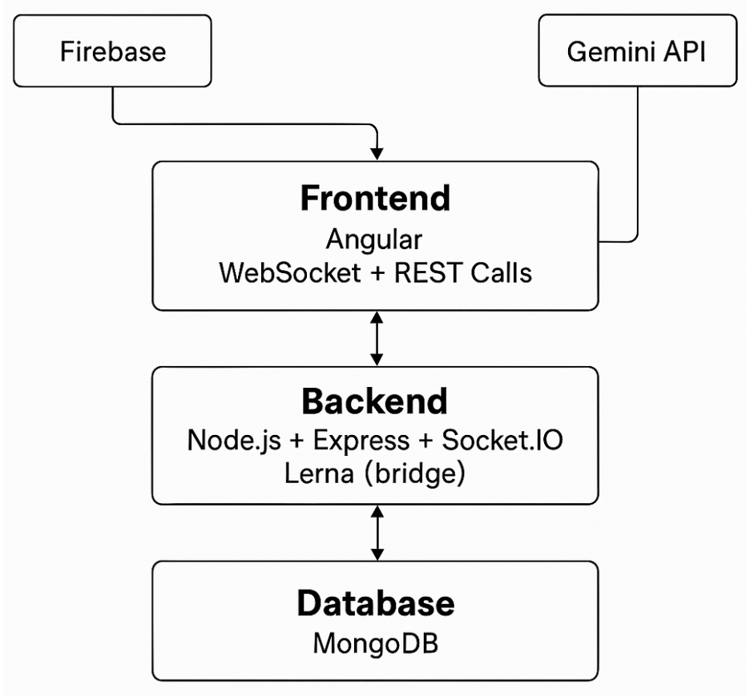
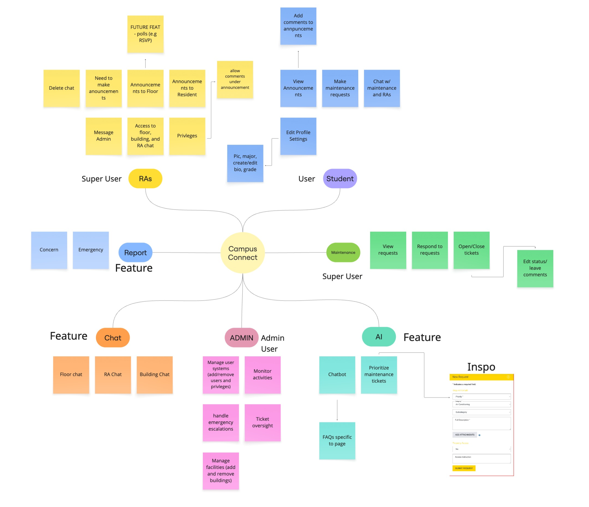

# Campus Connect

## Project Overview
Campus Connect is a full-stack monorepo application designed to improve how students interact with campus services. The system consists of an Angular frontend, a Node and Express backend, MongoDB for data persistence, and Socket.IO for real time communication. The goal of this project is to provide a responsive, student centered experience with live updates and reliable backend services.

## Repository Structure
• backend  
• frontend/campus-connect  
• docs  

## Prerequisites
The following tools must be installed before running the project:
• Node.js LTS version  
• npm  
• MongoDB Atlas or a local MongoDB instance  
• Git  

## Environment Configuration
This project uses environment variables for configuration. Create a `.env` file inside the `backend` directory. This file is **not** committed to version control and should remain local.

Required environment variables include:
• Server port  
• MongoDB connection string  
• Client URL  
• Authentication secrets  

Ensure `.env` is listed in `.gitignore`. Frontend configuration values are managed through Angular environment files located at:
`frontend/campus-connect/src/environments/`

## Install Dependencies
From the root of the repository run:
npm install

## Running the Project
From the root of the repository, start the application using:
`npm start`

This command starts both the backend API and the Angular frontend.

The frontend will be available at:
http://localhost:4200

## Demo Walkthrough
To demonstrate the application:

1. Start the project using `npm start`
2. Open the frontend in a browser  
3. Navigate through the main pages  
4. Perform a core action such as creating a request or sending a message  
5. Refresh the page to confirm data persistence  
6. If real time features are enabled, verify updates across sessions  

## Architecture
The following diagram illustrates the technical architecture of Campus Connect, including the frontend, backend, database, real time communication, and external services.

## Features by Role
A role and feature map is provided to help reviewers understand system scope:
